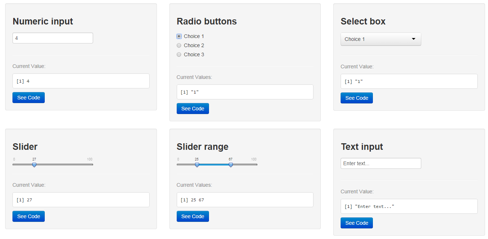

## Outline

- R in the Statistical Office
- Motivation
- About Shiny
- Shiny features
- Structure of a Shiny App
 - ui.R
 - server.R
- Example apps
- Reactive programming model
- Reactive sources end endpoints
- Applied example: ratio and index calculation
- Reactive conductors
- Applied example: SDMX

--- .class #id

## R and the Statistical Office

- Visit UNIDO to discuss automatic data validation
- Design interfaces: make R functions available to economists
- `gWidgets2` by John Verzani useful but complex and rigid
- `shiny` by Joe Cheng (now RStudio) very intuitive and flexible
- first test: app to explore Paris real estate offers
- challenge: can it be used for professional tasks?
 - trade-off between convention and customisation
 - expectations to interactive tools: when do they become useful?
 - can smooth transition from statistical to analytical tasks?

--- &twocol

## Motivation

*** =left

### +
- access speed
- routine operations
- reproducibility
- available methods
- flexibility of presentation
- user empowerment

*** =right

### -
- development time
- changing requirements
- maintenance
- transparency

--- .class #id

## What is Shiny?

- Interactive web applications around your R analysis
- Zero HTML/CSS/JavaScript knowledge is required...
- ...but fully customisable and extensible with HTML/CSS/JavaScript
- Designed to integrate with existing JavaScript libraries (for visualisation)
- Uses a [reactive](http://en.wikipedia.org/wiki/Reactive_programming) programming model which allows dramatically simpler code than traditional UI or web programming
- Shiny applications are automatically "live" in the same way that spreadsheets are live. Outputs change instantly as users modify inputs, without requiring a reload of the browser

Shiny comes in two parts:

1. the shiny R package for developing Shiny apps
2. Shiny server for deploying them

<!-- Source: https://github.com/rstudio/shiny -->

--- &twocol

## Structure of a Shiny App

Shiny apps have two components:

*** =left
a user-interface script

The user-interface script `ui.R` controls the layout and appearance of your app. It contains:

- layout information, e.g. default layouts, bootstrap theme, custom grid layout
- controls for `inputs` into the application, e.g. selectInput, sliderInput, numericInput
- appearance of `outputs`, e.g. text boxes, tables and plot size

*** =right
a server script

The server-side script `server.R` contains the instructions that are required to build the application. It can:

- use inputs from the ui script, e.g. for subsetting data or changing parameters
- create reactive elements that refresh when inputs change
- create `outputs` that are returned to the user interface

--- &twocol

## Reactive sources and endpoints

The simplest structure of a reactive program involves just a source and an endpoint:

<p style="text-align:center"></p>

*** =left
source

the source typically is user `input` through a browser interface (item selection, type text string, button click etc.). These actions will set values that are reactive sources. Reactive sources can signal objects `downstream` that they need to re-execute.

*** =right
endpoint

reactive endpoints are accessible through the `output` object (in most cases). A reactive endpoint is usually something that appears in the user's browser window, such as a plot or a table of values. Reactive endpoints can be told to re-execute by the reactive environment, and can request `upstream` objects to execute.

--- .class #id

## Example apps
### rCharts Polyplot

replication of tableau visualisation [Percentage of employed who are senior managers, by sex](http://www.oecd.org/gender/data/proportionofemployedwhoareseniormanagersbysex.htm)

- data: senior manager percentages by gender across countries
- source: International Labor Organization
- function: interactive data display with rCharts' `polycharts` binding
- reference: http://ramnathv.github.io/rChartsShiny/

Note: uses `global.R` script to load data

--- .class #id

<p style="text-align:center"></p>

--- .class #id

## Reactive programming model
### Reactive conductors

The amount of computation can be reduced by adding a reactive conductor in between the source and endpoints:

<p style="text-align:center"></p>

Reactive conductors are placed somewhere in between sources and endpoints on the reactive graph. They are typically used for encapsulating slow operations. Try to prevent unnecessary work, especially if the app needs to do a lot of slow computation.

http://shiny.rstudio.com/articles/reactivity-overview.html

--- .class #id

## Example apps
### histogram

simple histogram with slider to change the binwidth

- data: Waiting time between eruptions and the duration of the eruption for the Old Faithful geyser in Yellowstone National Park, Wyoming, USA.
- source: Azzalini, A. and Bowman, A. W. (1990). A look at some data on the Old Faithful geyser. Applied Statistics 39, 357–365.
- function: `seq` to create histogram breaks
- reference: http://shiny.rstudio.com/tutorial/lesson1/

--- .class #id

### histogram

<p style="text-align:center"></p>

--- .class #id

## Example apps
### k-means

k-means clustering, "X" marking the center of the cluster, points coloured according to clusters

- data: measurements in centimeters of the variables sepal length and width and petal length and width, respectively, for 50 flowers from each of 3 species of iris (Iris setosa, versicolor, and virginica).
- source: Anderson, Edgar (1935). The irises of the Gaspe Peninsula, Bulletin of the American Iris Society, 59, 2–5.
- function: clustering of iris data with `kmeans`
- reference: Joe Cheng on RStudio Shiny http://vimeo.com/94184686

--- .class #id

### k-means

<p style="text-align:center"></p>

--- .class #id

## `ui.R`: Inputs

- actionButton: Action Button
- checkboxInput: A single check box
- fileInput: A file upload control wizard
- helpText: Help text that can be added to an input form
- numericInput: A field to enter numbers
- radioButtons: A set of radio buttons
- selectInput: A box with choices to select from
- sliderInput: A slider bar
- textInput: A field to enter text

http://shiny.rstudio.com/tutorial/lesson3/

--- .class #id

### Input Widgets 1

<p style="text-align:center"></p>

--- .class #id

### Input Widgets 2

<p style="text-align:center"></p>

--- .class #id

## `ui.R` and `server.R`: Outputs

2 types:
- static (native R)
- dynamic / interactive (using JavaScript)

--- .class #id

## Example apps
### Interfacing complex functions: SDMX

- connecting to Java library from R
- obtain data flows from provider, its dimensions and select codes interacetively
- send SDMX query to retrieve values
- transform returned time series into table format, create basic plots and download information
- see example [SDMX > SDMX Browser](http://10.101.26.220:3838/industry) (only available from OECD network)

--- .class #id

## Indicator calculation
### Shares and indices

- define formula: `IPYE = VALK / EMPN / (VALK_2005 / EMPN_2005)`
- parse formula: remove non-alphanumeric characters: `[^a-zA-Z0-9]`
- subset data to variables: `subset(data,var%in%c("VALU","EMPN","VALK"))`
- pivot with denominators: `VALU|EMPN|VALK|VALU_2005|EMPN_2005|VALK_2005`
- calculate `IPYE` according to formula

Example: `stanIndic`

--- .class #id

## Indicator calculation
### Linear algebra

- select dimensions
- subset data from multidimensional arrays
- perform calculations:

```
data.couX.indX <- data.conv1 * data.demand
aaa <- xB %*% data.couX.indX
aaa <- apply(aaa, 1, sum)
```

- aggregate results

Example: `icioFddva`

--- .class #id

## Outputs
### Export data and charts

Example:

--- .class #id

## Radiant
### Report generation

Create HTML reports with embedded `Ace` text editor

--- .class #id

## Radiant
### Integrate independent applications

Generate applications from a single script using functions

--- .class #id

## System Architecture


- testing environment: http://10.101.26.220:3838/industry
- production environment: http://oecd-icio.cloudapp.net:3838

--- .class #id

## References

Developer page: http://shiny.rstudio.com
